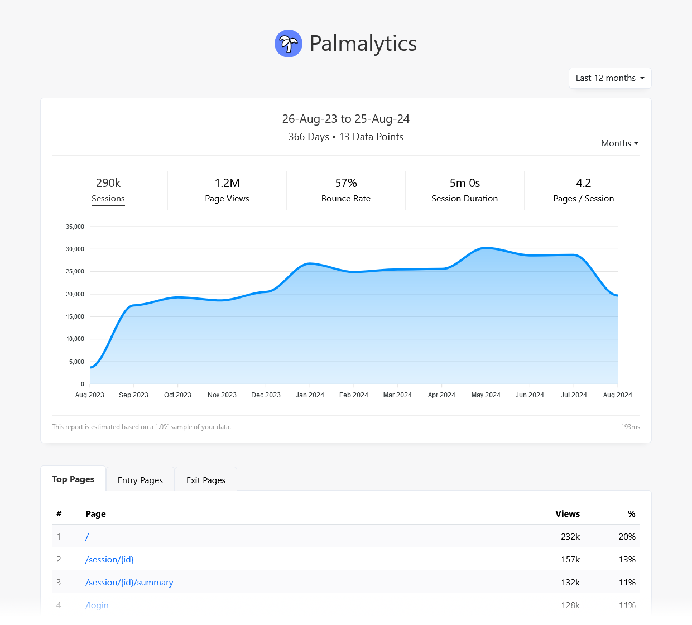

# Palmalytics

Palmalytics is a self-hosted, first-party, server-side web analytics dashboard for ASP.NET Core applications. It can replace standard client-side web analytics tools like Google Analytics and Matomo. It tracks pageviews, sessions, referrals, locations, user agents, and more.


## Why Server-Side Analytics?

Unlike client-side analytics, server-side analytics offers the following advantages:

- **High Performance**: Minimal impact on the server side as data is saved asynchronously, and zero impact on the client side.
- **User-Friendly**: No cookies, no annoying consent popups.
- **Accuracy**: Not blocked by adblockers and privacy-focused browsers and extensions.
- **Data Ownership**: You own your data, and it doesn’t leave your server.

The data can be stored in the same database your application already uses (e.g. SQL Server), which means you can also easily query it if you'd like.


## Getting Started

1. Add the NuGet package from the Package Manager Console:

    ```shell
    PM> Install-Package Palmalytics.SqlServer -Pre
    ```
    
2. Register services in your `Startup.cs` and configure the SQL Server storage:

    ```csharp
    public void ConfigureServices(IServiceCollection services)
    {
        services.AddPalmalytics(options => {
            options.UseSqlServer(new SqlServerOptions
            {
                ConnectionString = Configuration.GetConnectionString("PalmalyticsConnection"),
                Schema = "Palmalytics"
            });
        });

        // ...other services
    }
    ```
    
3. Register the middleware:

    ```csharp
    public void Configure(IApplicationBuilder app)
    {
        app.UsePalmalytics();

        // ...other middleware
    }
    ```
    
4. Navigate to `https://<your-app>/palmalytics` to see your dashboard.



## Dashboard Authorization

By default, the dashboard is only accessible by local requests. In production, you will probably want to change this. Here are some options:

### Public access

If you want to allow public access to your dashboard, just remove the default authorization rule:

```csharp
services.AddPalmalytics(options =>
{
    options.DashboardOptions.Authorize = null;
    // ... other options
}
```

### Restricted access

You can implement your own authorization rule, for example based on ASP.NET user roles:

```csharp
services.AddPalmalytics(options =>
{
    options.DashboardOptions.Authorize = (context) =>
    {
        return context.User.IsInRole("Admin");
    };

    // ... other options
}
```


## Requirements

Currently, Palmalytics requires:

- .NET 6
- SQL Server for storage

Future support is planned for older versions of .NET (including .NET Framework 4.x) as well as other data stores (Postgres, SQLite…).


## Project Status

The project is currently in alpha release – use at your own risk.


## Licensing

Copyright © 2024 Xavier Poinas

Palmalytics is licensed under the GNU General Public License (GPL v3), which means that if you include it in your project, you will need to release its source code to comply with the terms of the license. If you don’t want to do that, you can obtain a commercial license.

While Palmalytics is in pre-release, you can get a free early-bird lifetime commercial license by emailing [licensing@palmalytics.com](mailto:licensing@palmalytics.com). This includes free upgrades to all future versions, including major versions.


## Contributing

Contributions are welcome, whether they are bug reports, feature requests, or code contributions.

By submitting a pull request, you relinquish any rights or claims to the changes you submit to the project and transfer the copyright of those changes to the project owner.